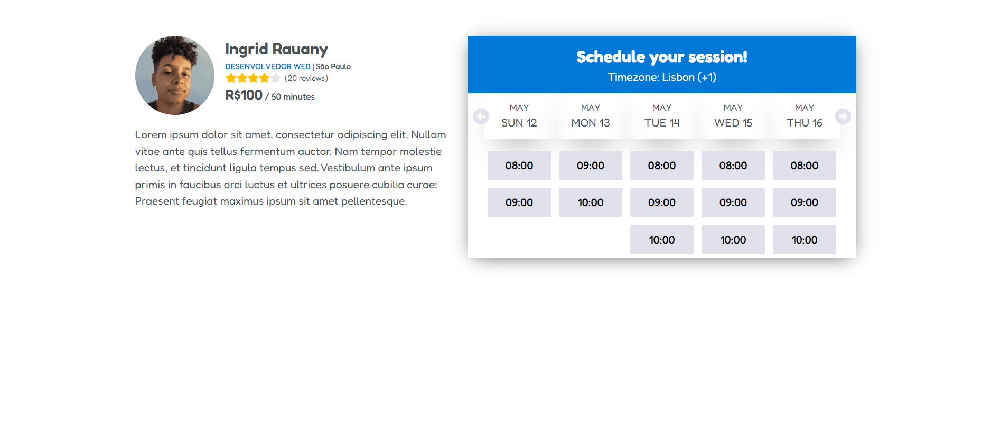
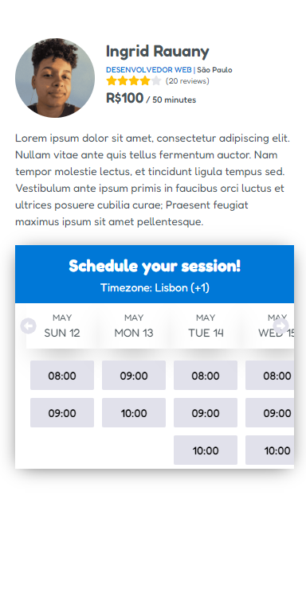

# Desafio Técnico Zenklub

## Sumário

- [Overview](#overview)
  - [O desafio](#o-desafio)
  - [Prints da aplicação](#prints-da-aplicação)
  - [Executando a aplicação](#executando-a-aplicação)
  - [Testes](#testes)
- [Meu processo](#meu-processo)
  - [Construído com](#construido-com)
  - [Próximos passos](#próximos-passos)
  - [Melhorias possíveis](#melhorias-possíveis)

## Overview

### O desafio

Criar uma tela que mostre dados de um profissional e seus horários para atendimento disponíveis no intervalo de 5 dias. Tendo a possibilidade de alterar esse intervalo de data para o próximo dia ou dia anterior.

### Prints da aplicação

Desktop:


Mobile:


### Executando a aplicação

Primeiro baixe os pacotes da aplicação:

```bash
npm install
```

Execute o back-end que irá dispobilizar os dados a serem consultados:

```bash
npm run backend
```

Depois execute o servidor de desenvolvimento:

```bash
npm run dev
```

Abra [http://localhost:5138](http://localhost:5138) com seu navegador para ver o resultado.

### Testes

Para executar os testes automatizados execute:

```bash
npm run test
```

## Meu processo

### ⚙️ Construído com:

- HTML semântico
- Flexbox/Grid Layout
- React/Typescript
- [Vite](https://vitejs.dev/)
- [Styled Components](https://styled-components.com/) - Para componentes e estilos
- `Editorconfig`, `prettier` e `eslint` para formatação e linter de código
- [json-server](https://github.com/typicode/json-server) para simular uma API para consumo pelo frontend
- [React Query](https://tanstack.com/query/latest): para lidar com as chamadas aos endpoint (lidando melhor com loading e erros)
- [Vitest](https://vitest.dev/): para escrita de teste unitários

### Próximos passos

- Conseguir preencher os horário não existentes com um `-` como no layout de referência.
- Construir o botão de `More` do layout de referência.
- Ajustar `hover` dos botões de navegação do calendário.
- Escrita de testes para os demais `hooks`, services e componentes.

### Melhorias possíveis

- Configurar o `axios` para ter uma configuração para um endpoint base (que no caso seria: `http://localhost:8000/professionals`).
- Melhorar o componente `ProfileStars`.
- Com um backend mais robusto seria possível melhorar a busca de horários usando o próprio campo `date` (que no projeto atual foi feito através de um campo auxiliar).
- Ter um componente que liste os profissionais e após clicar em um profissional específico carregar a tela atual e passar o `id` do profissional como paramêtro para ser usado na tela em desenvolvimento (e assim remover o `id`que está `hard coded` no componente de `Container`).
- Trabalhar melhor com os ícones, evitando estilização inline.
- Melhorar o cabeçalho de datas do calendário para conseguir trabalhar melhor com um `border-shadow` nele.
